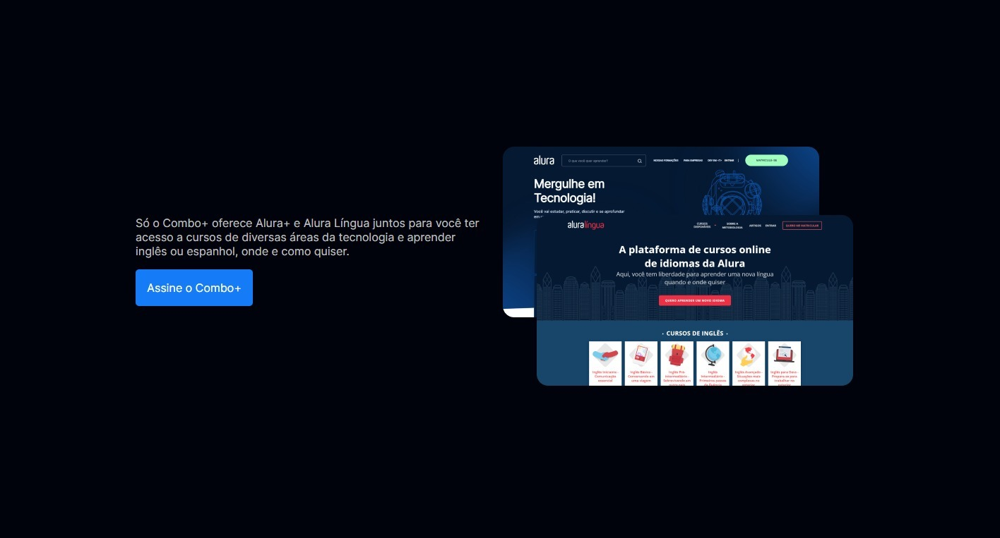
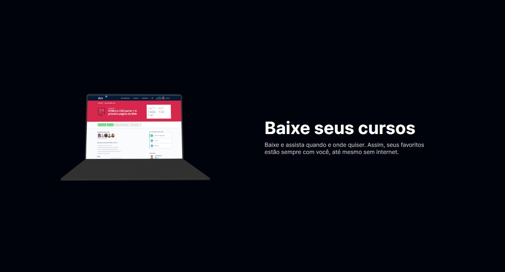
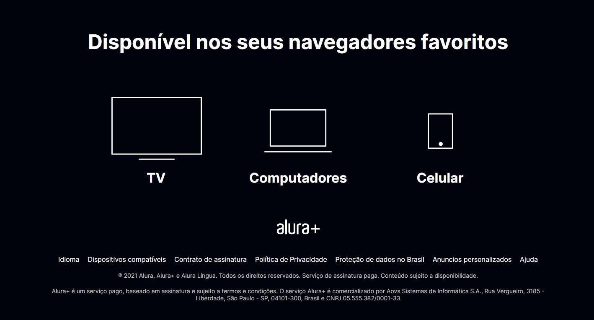

# Jogo do Número Secreto 
Projeto do AluraPlus desenvolvido no curso de Praticando HTML e CSS da Alura com Mônica Hillman. Projeto meramente ilustrativo e sem automações, apenas educativo:
 

  
Um projeto simples apenas envolvendo:
* HTML
* CSS

Este mesmo me ajudou a fortalecer minha base em HTML e CSS e aprofundar na prática em outros conteúdos que ainda não tinha visto anteriormente, como conceitos de:
* Proprieadades CSS grid e grid-template-columns para dividir a tela;
* Reutilizar estilos através das classes dentro da nova section;
* Atribuir mais de uma classe nos elementos para incluir novas estilizações além das existentes;
* A pseudo-classe: active.

Mais um pequeno projeto somente visual para não perder o costume e continuar melhorando :)